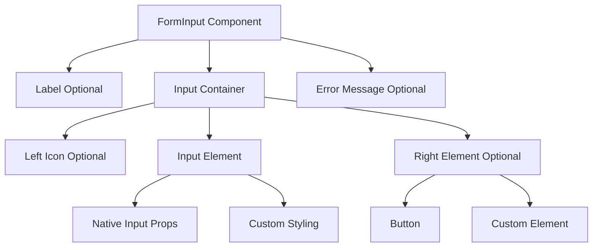

# مستند التصميم: مكون FormInput القابل لإعادة الاستخدام

## نظرة عامة

مكون `FormInput` هو مكون React قابل لإعادة الاستخدام يوفر حقل إدخال مخصص بتصميم موحد عبر التطبيق. يدعم المكون الأيقونات على اليسار، العناصر التفاعلية على اليمين (مثل زر إظهار/إخفاء كلمة المرور)، التسميات المدمجة، رسائل الخطأ، ودعم كامل لـ RTL/LTR. التصميم مستوحى من حقول الإدخال الموجودة في صفحة تسجيل الدخول مع تحسينات لجعله أكثر مرونة وقابلية لإعادة الاستخدام.

## البنية المعمارية



## مخطط التسلسل للتفاعل

```mermaid
sequenceDiagram
    participant User as المستخدم
    participant FormInput as FormInput Component
    participant Input as Input Element
    participant RightElement as Right Element (Optional)
    
    User->>FormInput: يدخل نصاً
    FormInput->>Input: يحدث onChange
    Input-->>FormInput: قيمة جديدة
    FormInput-->>User: يعرض القيمة
    
    User->>RightElement: ينقر على الزر (مثل: إظهار كلمة المرور)
    RightElement->>FormInput: يغير الحالة
    FormInput->>Input: يحدث نوع الإدخال (text/password)
    Input-->>User: يعرض التغيير
