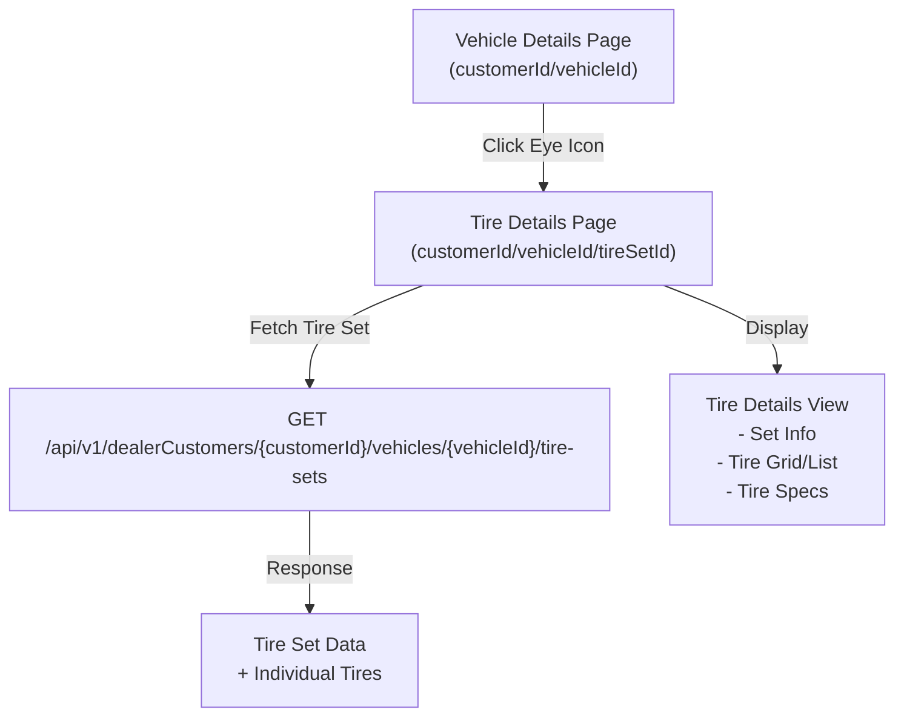
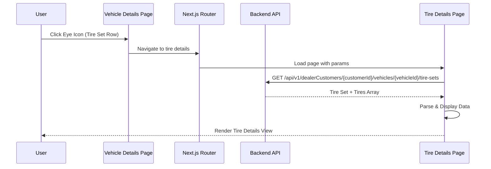

# Design Document: tire-details-view

## Overview

The tire-details-view feature adds a detailed tire information page accessible from the vehicle details page. Users can click an eye icon in the Tire Sets table to navigate to a dedicated page displaying comprehensive information about each tire in a tire set, including tread condition, mileage, position, and other technical specifications. This feature enhances visibility into tire inventory and condition tracking.

## Architecture



## Sequence Diagram



## Components and Interfaces

### Component 1: Tire Details Page

**Path**: `src/app/dashboard/customers/[customerId]/vehicles/[vehicleId]/tire-sets/[tireSetId]/page.tsx`

**Purpose**: Main page component that fetches and displays tire set details with individual tire information.

**Interface**:
```typescript
interface TireDetailsPageProps {
  params: {
    customerId: string
    vehicleId: string
    tireSetId: string
  }
}

interface TireSetDetail {
  id: string
  vehicleId: string
  tireCount: number
  seasonType: 'SUMMER' | 'WINTER' | 'ALL_SEASON'
  brand: string
  size: string
  displayLabel: string
  createdAt: string
}

interface TireDetail {
  id: string
  vehicleId: string
  tireSetId: string
  wheelPosition: string
  tireUniqueId: string
  tireType: string
  treadWidth: string
  aspectRatio: string
  construction: string
  diameter: string
  composition: string
  mileage: number
  treadCondition: string
  status: 'GOOD' | 'FAIR' | 'POOR' | 'CRITICAL'
  brand: string
  model: string
  size: string
  description: string
  scanMetadata: Record<string, unknown>
  addedDate: string
  updatedDate: string
  createdAt: string
  updatedAt: string
  version: number
}
```

**Responsibilities**:
- Fetch tire set and tire details from API
- Handle loading and error states
- Pass data to child components for rendering
- Provide navigation back to vehicle details

### Component 2: Tire Set Header

**Purpose**: Display tire set summary information (brand, size, season, quantity, date added).

**Interface**:
```typescript
interface TireSetHeaderProps {
  tireSet: TireSetDetail
  onBack: () => void
}
```

**Responsibilities**:
- Display tire set metadata
- Show back navigation button
- Display season type badge
- Show creation date

### Component 3: Tire Grid/List

**Purpose**: Display individual tires in a grid or list layout with key information.

**Interface**:
```typescript
interface TireGridProps {
  tires: TireDetail[]
  viewMode: 'grid' | 'list'
  onTireSelect?: (tire: TireDetail) => void
}

interface TireCardProps {
  tire: TireDetail
  onSelect?: (tire: TireDetail) => void
}
```

**Responsibilities**:
- Render tires in grid or list format
- Display tire position, size, brand, model
- Show status badge with color coding
- Handle tire selection for detailed view

### Component 4: Tire Details Modal/Drawer

**Purpose**: Display comprehensive tire specifications when a tire is selected.

**Interface**:
```typescript
interface TireDetailsModalProps {
  tire: TireDetail
  isOpen: boolean
  onClose: () => void
}
```

**Responsibilities**:
- Display all tire specifications
- Show tread condition and mileage
- Display scan metadata if available
- Show version and update history

## Data Models

### TireSet Model

```typescript
interface TireSet {
  id: string
  vehicleId: string
  tireCount: number
  seasonType: 'SUMMER' | 'WINTER' | 'ALL_SEASON'
  brand: string
  size: string
  displayLabel: string
  createdAt: string
}
```

**Validation Rules**:
- `id` must be non-empty string
- `vehicleId` must be non-empty string
- `tireCount` must be positive integer (typically 4)
- `seasonType` must be one of the defined enum values
- `brand` must be non-empty string
- `size` must match tire size format (e.g., "225/45R17")
- `createdAt` must be valid ISO 8601 datetime

### Tire Model

```typescript
interface Tire {
  id: string
  vehicleId: string
  tireSetId: string
  wheelPosition: string
  tireUniqueId: string
  tireType: string
  treadWidth: string
  aspectRatio: string
  construction: string
  diameter: string
  composition: string
  mileage: number
  treadCondition: string
  status: 'GOOD' | 'FAIR' | 'POOR' | 'CRITICAL'
  brand: string
  model: string
  size: string
  description: string
  scanMetadata: Record<string, unknown>
  addedDate: string
  updatedDate: string
  createdAt: string
  updatedAt: string
  version: number
}
```

**Validation Rules**:
- `id` must be non-empty string
- `wheelPosition` must be one of: 'FL' (Front Left), 'FR' (Front Right), 'RL' (Rear Left), 'RR' (Rear Right)
- `mileage` must be non-negative number
- `status` must be one of the defined enum values
- `treadCondition` must be numeric percentage or descriptive string
- All date fields must be valid ISO 8601 datetime
- `version` must be non-negative integer

## Algorithmic Pseudocode

### Main Tire Details Fetch Algorithm

```pascal
ALGORITHM fetchTireDetails(customerId, vehicleId, tireSetId)
  INPUT: customerId (string), vehicleId (string), tireSetId (string)
  OUTPUT: tireSetDetail (TireSet), tiresList (Tire[])
  
  PRECONDITION:
    customerId ≠ ∅ AND vehicleId ≠ ∅ AND tireSetId ≠ ∅
    User is authenticated with valid access token
    User has permission to view this vehicle's tire sets
  
  POSTCONDITION:
    tireSetDetail is valid TireSet object
    tiresList is non-empty array of Tire objects
    All tires belong to specified tireSetId
    All tires have valid status values
  
  BEGIN
    TRY
      // Step 1: Construct API endpoint
      endpoint ← "/api/v1/dealerCustomers/" + customerId + 
                 "/vehicles/" + vehicleId + "/tire-sets"
      
      // Step 2: Make API request with authentication
      response ← GET(endpoint, headers={Authorization: bearerToken})
      
      // Step 3: Validate response status
      IF response.status ≠ 200 THEN
        THROW HttpError(response.status, response.message)
      END IF
      
      // Step 4: Parse response data
      data ← parseJSON(response.body)
      
      // Step 5: Extract tire set matching tireSetId
      tireSetDetail ← NULL
      FOR EACH tireSet IN data.tireSets DO
        IF tireSet.id = tireSetId THEN
          tireSetDetail ← tireSet
          BREAK
        END IF
      END FOR
      
      // Step 6: Validate tire set found
      IF tireSetDetail = NULL THEN
        THROW NotFoundError("Tire set not found")
      END IF
      
      // Step 7: Extract and validate tires
      tiresList ← []
      FOR EACH tire IN data.tires DO
        IF tire.tireSetId = tireSetId THEN
          // Validate tire data
          ASSERT tire.id ≠ ∅
          ASSERT tire.wheelPosition ∈ {FL, FR, RL, RR}
          ASSERT tire.status ∈ {GOOD, FAIR, POOR, CRITICAL}
          ASSERT tire.mileage ≥ 0
          
          tiresList.append(tire)
        END IF
      END FOR
      
      // Step 8: Validate at least one tire exists
      IF tiresList.length = 0 THEN
        THROW ValidationError("No tires found for this set")
      END IF
      
      RETURN (tireSetDetail, tiresList)
      
    CATCH HttpError AS e
      IF e.status = 401 THEN
        THROW AuthenticationError("Session expired")
      ELSE IF e.status = 403 THEN
        THROW AuthorizationError("Access denied")
      ELSE IF e.status = 404 THEN
        THROW NotFoundError("Vehicle or tire set not found")
      ELSE
        THROW ServerError(e.message)
      END IF
    CATCH ParseError AS e
      THROW ValidationError("Invalid response format: " + e.message)
    END TRY
  END
END ALGORITHM
```

**Preconditions**:
- All parameters are non-empty strings
- User is authenticated with valid bearer token
- User has permission to access this customer's vehicle data

**Postconditions**:
- Returns valid tire set and tires array
- All tires belong to the specified tire set
- All data is properly validated and typed

**Loop Invariants**:
- All processed tires have valid tireSetId matching the requested tireSetId
- All processed tires have valid status values
- Tire list maintains insertion order from API response

### Tire Status Determination Algorithm

```pascal
ALGORITHM determineTireStatus(treadCondition, mileage, maxMileage)
  INPUT: treadCondition (string/number), mileage (number), maxMileage (number)
  OUTPUT: status (GOOD | FAIR | POOR | CRITICAL)
  
  PRECONDITION:
    treadCondition is valid percentage or descriptive string
    mileage ≥ 0
    maxMileage > 0
  
  POSTCONDITION:
    status is one of the defined enum values
    status reflects tire condition accurately
  
  BEGIN
    // Convert treadCondition to percentage if string
    IF treadCondition IS string THEN
      treadPercent ← parsePercentage(treadCondition)
    ELSE
      treadPercent ← treadCondition
    END IF
    
    // Calculate mileage ratio
    mileageRatio ← mileage / maxMileage
    
    // Determine status based on tread and mileage
    IF treadPercent ≥ 75 AND mileageRatio ≤ 0.5 THEN
      RETURN GOOD
    ELSE IF treadPercent ≥ 50 AND mileageRatio ≤ 0.75 THEN
      RETURN FAIR
    ELSE IF treadPercent ≥ 25 AND mileageRatio ≤ 0.9 THEN
      RETURN POOR
    ELSE
      RETURN CRITICAL
    END IF
  END
END ALGORITHM
```

## Key Functions with Formal Specifications

### Function 1: useTireSetDetails()

```typescript
function useTireSetDetails(
  customerId: string | undefined,
  vehicleId: string | undefined,
  tireSetId: string | undefined
): {
  tireSet: TireSetDetail | null
  tires: TireDetail[]
  isLoading: boolean
  error: Error | null
}
```

**Preconditions**:
- `customerId`, `vehicleId`, `tireSetId` are either undefined or non-empty strings
- If all three are defined, they must be valid identifiers
- User must be authenticated

**Postconditions**:
- Returns object with tireSet, tires array, loading state, and error
- If loading: `isLoading === true`, other fields may be null/empty
- If successful: `error === null`, `tireSet` is valid object, `tires` is non-empty array
- If error: `error` contains error details, `tireSet` is null, `tires` is empty array
- No side effects on input parameters

**Loop Invariants**: N/A (hook, not iterative)

### Function 2: getTireSetDetailsService()

```typescript
async function getTireSetDetailsService(
  customerId: number,
  vehicleId: number,
  tireSetId: string
): Promise<{ tireSet: TireSetDetail; tires: TireDetail[] }>
```

**Preconditions**:
- `customerId` is positive integer
- `vehicleId` is positive integer
- `tireSetId` is non-empty string
- API endpoint is accessible
- User has valid authentication token

**Postconditions**:
- Returns object with valid `tireSet` and `tires` array
- All tires have `tireSetId` matching the requested `tireSetId`
- All data is validated against schemas
- If error: throws descriptive error with HTTP status or message

**Loop Invariants**: N/A (service function, not iterative)

### Function 3: formatTireSize()

```typescript
function formatTireSize(
  treadWidth: string,
  aspectRatio: string,
  construction: string,
  diameter: string
): string
```

**Preconditions**:
- All parameters are non-empty strings
- Format: treadWidth (e.g., "225"), aspectRatio (e.g., "45"), construction (e.g., "R"), diameter (e.g., "17")

**Postconditions**:
- Returns formatted tire size string (e.g., "225/45R17")
- Format is consistent and readable
- No mutations to input parameters

**Loop Invariants**: N/A (formatting function)

## Example Usage

```typescript
// Example 1: Navigate to tire details page
import { useRouter } from 'next/navigation'

function TireSetRow({ tireSet, customerId, vehicleId }) {
  const router = useRouter()
  
  const handleViewDetails = () => {
    router.push(
      `/dashboard/customers/${customerId}/vehicles/${vehicleId}/tire-sets/${tireSet.id}`
    )
  }
  
  return (
    <button onClick={handleViewDetails}>
      <Eye size={18} />
    </button>
  )
}

// Example 2: Fetch tire details in page component
async function TireDetailsPage({ params }) {
  const { customerId, vehicleId, tireSetId } = params
  
  try {
    const { tireSet, tires } = await getTireSetDetailsService(
      parseInt(customerId),
      parseInt(vehicleId),
      tireSetId
    )
    
    return (
      <div>
        <TireSetHeader tireSet={tireSet} />
        <TireGrid tires={tires} />
      </div>
    )
  } catch (error) {
    return <ErrorComponent error={error} />
  }
}

// Example 3: Use hook in client component
function TireDetailsClient({ customerId, vehicleId, tireSetId }) {
  const { tireSet, tires, isLoading, error } = useTireSetDetails(
    customerId,
    vehicleId,
    tireSetId
  )
  
  if (isLoading) return <LoadingSpinner />
  if (error) return <ErrorAlert error={error} />
  
  return (
    <>
      <TireSetHeader tireSet={tireSet} />
      <TireGrid tires={tires} />
    </>
  )
}

// Example 4: Display tire with status
function TireCard({ tire }) {
  const statusColor = {
    GOOD: 'bg-green-100 text-green-800',
    FAIR: 'bg-yellow-100 text-yellow-800',
    POOR: 'bg-orange-100 text-orange-800',
    CRITICAL: 'bg-red-100 text-red-800'
  }
  
  return (
    <div className="border rounded-lg p-4">
      <div className="flex justify-between items-start">
        <div>
          <h3>{tire.brand} {tire.model}</h3>
          <p className="text-sm text-gray-600">{tire.size}</p>
          <p className="text-sm">Position: {tire.wheelPosition}</p>
        </div>
        <span className={`px-2 py-1 rounded text-sm ${statusColor[tire.status]}`}>
          {tire.status}
        </span>
      </div>
      <div className="mt-3 grid grid-cols-2 gap-2 text-sm">
        <div>Tread: {tire.treadCondition}</div>
        <div>Mileage: {tire.mileage} km</div>
      </div>
    </div>
  )
}
```

## Correctness Properties

*A property is a characteristic or behavior that should hold true across all valid executions of a system—essentially, a formal statement about what the system should do. Properties serve as the bridge between human-readable specifications and machine-verifiable correctness guarantees.*

### Property 1: Tire Set Retrieval Correctness

*For any* valid identifiers (customerId, vehicleId, tireSetId), the returned tire set must have matching ID and vehicle ID.

**Validates: Requirements 2.1, 2.2**

### Property 2: Tire Set Completeness

*For any* tire set, the tire count in the set must equal the actual number of tires returned.

**Validates: Requirements 6.1**

### Property 3: Tire Position Uniqueness

*For any* tire set, no two tires in the same set can have the same wheel position.

**Validates: Requirements 6.2**

### Property 4: Status Validity

*For any* tire, the tire status must be one of the valid enum values (GOOD, FAIR, POOR, CRITICAL).

**Validates: Requirements 4.3, 6.4**

### Property 5: Data Consistency

*For any* API response, all returned tires must belong to the requested tire set and vehicle.

**Validates: Requirements 2.2, 6.3**

### Property 6: URL Parameter Extraction

*For any* valid URL parameters (customerId, vehicleId, tireSetId), the system must correctly extract and validate all three parameters.

**Validates: Requirements 1.2, 13.1, 13.2, 13.3**

### Property 7: Tire Size Formatting

*For any* tire with valid size components (treadWidth, aspectRatio, construction, diameter), the formatted size must follow the pattern "treadWidth/aspectRatioConstructionDiameter".

**Validates: Requirements 4.5, 8.1, 8.2**

### Property 8: Tire Information Completeness

*For any* tire displayed in the grid or list, all required information (position, brand, model, size, status, mileage, tread condition) must be present.

**Validates: Requirements 4.1, 4.2, 4.4, 10.1, 10.2, 11.1, 11.2**

### Property 9: Tire Modal Information Completeness

*For any* tire displayed in the modal, all tire properties (tread condition, mileage, tread width, aspect ratio, construction, diameter, composition, description, scan metadata, version) must be present when available.

**Validates: Requirements 5.2, 5.3, 5.4, 10.3, 10.4, 11.3, 11.4, 11.5, 12.1, 12.2, 12.3, 12.4**

### Property 10: Tire Set Header Information Completeness

*For any* tire set, the header must display all required information (brand, size, season type, tire count, creation date).

**Validates: Requirements 3.1, 3.2, 15.1, 15.2**

### Property 11: Bearer Token Inclusion

*For any* API request to fetch tire details, the Authorization header must include a valid bearer token.

**Validates: Requirements 2.1, 9.1**

## Error Handling

### Error Scenario 1: Unauthorized Access (401)

**Condition**: User's authentication token is invalid or expired
**Response**: Redirect to login page, display "Session expired" message
**Recovery**: User logs in again and navigates back to tire details

### Error Scenario 2: Forbidden Access (403)

**Condition**: User doesn't have permission to view this customer's data
**Response**: Display "Access denied" error, show back button
**Recovery**: User navigates back to dashboard

### Error Scenario 3: Not Found (404)

**Condition**: Vehicle, tire set, or tire data doesn't exist
**Response**: Display "Tire set not found" error with back navigation
**Recovery**: User navigates back to vehicle details

### Error Scenario 4: Invalid Data Format

**Condition**: API response doesn't match expected schema
**Response**: Display "Failed to load tire details" error
**Recovery**: User can retry or navigate back

### Error Scenario 5: Network Error

**Condition**: Network request fails or times out
**Response**: Display "Connection error" message with retry button
**Recovery**: User clicks retry to fetch data again

## Testing Strategy

### Unit Testing Approach

**Test Coverage Areas**:
- Tire size formatting function with various input combinations
- Status determination algorithm with edge cases (boundary values)
- Data validation and schema parsing
- Error handling for invalid inputs

**Key Test Cases**:
- Valid tire size formatting: "225/45R17"
- Status determination: tread 75%+ → GOOD, 50-75% → FAIR, etc.
- Schema validation: reject invalid status values, missing required fields
- Error messages: verify correct error type and message for each scenario

### Property-Based Testing Approach

**Property Test Library**: fast-check (JavaScript/TypeScript)

**Properties to Test**:
1. **Tire Set ID Consistency**: For any valid tire set, returned tires always have matching tireSetId
2. **Tire Count Accuracy**: Tire count in set equals actual number of tires returned
3. **Position Uniqueness**: No duplicate wheel positions in same tire set
4. **Status Validity**: All tire statuses are valid enum values
5. **Data Immutability**: Fetched data doesn't mutate during processing

**Example Property Test**:
```typescript
import fc from 'fast-check'

test('tire set ID consistency property', () => {
  fc.assert(
    fc.property(
      fc.integer({ min: 1, max: 1000000 }),
      fc.integer({ min: 1, max: 1000000 }),
      fc.uuid(),
      async (customerId, vehicleId, tireSetId) => {
        const result = await getTireSetDetailsService(customerId, vehicleId, tireSetId)
        
        // All tires must belong to the requested tire set
        result.tires.forEach(tire => {
          expect(tire.tireSetId).toBe(tireSetId)
          expect(tire.vehicleId).toBe(vehicleId.toString())
        })
      }
    )
  )
})
```

### Integration Testing Approach

**Test Scenarios**:
- Navigate from vehicle details to tire details page
- Fetch tire set and display in UI
- Click on individual tire to view detailed specs
- Navigate back to vehicle details
- Handle API errors gracefully
- Verify all data displays correctly

## Performance Considerations

- **API Response Caching**: Cache tire set details for 5 minutes to reduce API calls
- **Lazy Loading**: Load tire details on demand when user clicks tire card
- **Image Optimization**: Compress tire images if included in future versions
- **Pagination**: If tire count exceeds 20, implement pagination or virtual scrolling
- **Query Optimization**: Fetch only required fields from API

## Security Considerations

- **Authentication**: Verify user is authenticated before fetching tire data
- **Authorization**: Verify user has permission to view this customer's vehicle data
- **Input Validation**: Validate all URL parameters (customerId, vehicleId, tireSetId)
- **XSS Prevention**: Sanitize any user-generated content in tire descriptions
- **CSRF Protection**: Use Next.js built-in CSRF protection for any mutations
- **Rate Limiting**: Implement rate limiting on API calls to prevent abuse

## Dependencies

**External Libraries**:
- `next` (routing, server components)
- `axios` (HTTP client)
- `zod` (schema validation)
- `react-query` or `swr` (data fetching and caching)
- `lucide-react` (icons)

**Internal Modules**:
- `src/lib/api` (API client)
- `src/modules/vehicles` (vehicle types and services)
- `src/components/ui` (UI components)
- `src/constants/routes` (route definitions)

**API Endpoints**:
- `GET /api/v1/dealerCustomers/{customerId}/vehicles/{vehicleId}/tire-sets`
